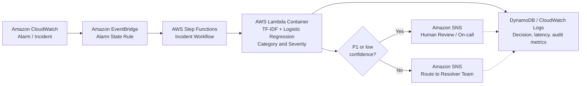

# Architecture Diagram

```mermaid
flowchart LR
    A[Amazon CloudWatch<br/>Alarm / Incident] --> B[Amazon EventBridge<br/>Alarm State Rule]
    B --> C[AWS Step Functions<br/>Incident Workflow]
    C --> D[AWS Lambda Container<br/>TF-IDF + Logistic Regression<br/>Category and Severity]
    D --> E{P1 or low<br/>confidence?}
    E -->|Yes| F[Amazon SNS<br/>Human Review / On-call]
    E -->|No| G[Amazon SNS<br/>Route to Resolver Team]
    D --> H[DynamoDB / CloudWatch Logs<br/>Decision, latency, audit metrics]
    F -.-> H
    G -.-> H
```

The Graphviz source for the same architecture is available in `architecture.dot`.
